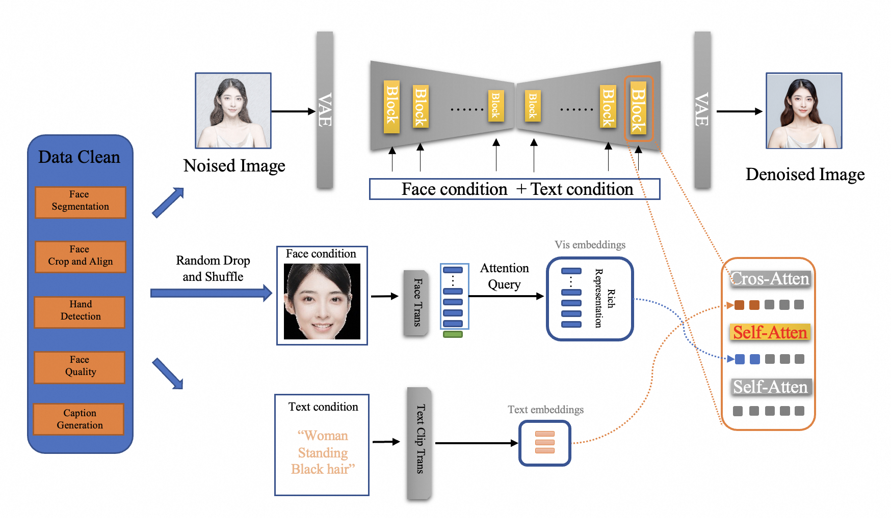

Hi, my name is Jun Dan.

I'm a 5th-year Ph.D. student at [Zhejiang University](https://www.zju.edu.cn/).\
Previously, I graduated with a bachelor’s degree in 2020 from the School of Microelectronics and Communication Engineering at [Chongqing University](https://www.cqu.edu.cn/).

**Research Interests:**
* Transfer Learning
* Face Perception and Understanding
* AIGC
* Data-Centric AI

My selected open-source projects:  
  
(1) [FaceChain ](https://github.com/modelscope/facechain); 

(2) [TransFace ](https://github.com/modelscope/facechain/tree/main/face_module/TransFace); TransFace model has reached over **13K+** downloads on the [ModelScope](https://www.modelscope.cn/models/iic/cv_vit_face-recognition) platform.

(3) [TopoFR ](https://github.com/modelscope/facechain/tree/main/face_module/TopoFR);

Publications
======
* **TFGDA: Exploring Topology and Feature Alignment in Semi-supervised Graph Domain Adaptation through Robust Clustering**. [[PDF]](https://openreview.net/forum?id=26BdXIY3ik&referrer=%5BAuthor%20Console%5D(%2Fgroup%3Fid%3DNeurIPS.cc%2F2024%2FConference%2FAuthors%23your-submissions))\
**Dan J**, Liu W, Tan Y, et al.
<em>Accepted by NeurIPS 2024, Main Track.</em>

* **TopoFR: A Closer Look at Topology Alignment on Face Recognition**. [[PDF]](https://openreview.net/forum?id=KVAx5tys2p&referrer=%5BAuthor%20Console%5D(%2Fgroup%3Fid%3DNeurIPS.cc%2F2024%2FConference%2FAuthors%23your-submissions)) [[CODE]](https://github.com/modelscope/facechain/tree/main/face_module/TopoFR) [[机器之心]](https://www.jiqizhixin.com/articles/2024-10-17-6) [[CSDN]](https://blog.csdn.net/sunbaigui/article/details/143230746) [[CVer]](https://mp.weixin.qq.com/s/3NegnpJUGPfI_dOfkp_4LQ)\
**Dan J**, Liu Y, Deng J, et al. 
<em>Accepted by NeurIPS 2024, Main Track.</em>

* **TransFace: Calibrating Transformer Training for Face Recognition from a Data-Centric Perspective**. [[PDF]](https://openaccess.thecvf.com/content/ICCV2023/html/Dan_TransFace_Calibrating_Transformer_Training_for_Face_Recognition_from_a_Data-Centric_ICCV_2023_paper.html) [[CODE]](https://github.com/DanJun6737/TransFace) [[ModelScope]](https://www.modelscope.cn/models/iic/cv_vit_face-recognition) [[阿里云]](https://developer.aliyun.com/article/1319924) [[CVer]](https://mp.weixin.qq.com/s/n9HKqZ7DAt5Woo5BCwxq6w) [[CSDN]](https://blog.csdn.net/sunbaigui/article/details/136556006)\
**Dan J**, Liu Y, Xie H, et al. 
<em>Proceedings of the IEEE/CVF international conference on computer vision (ICCV). 2023: 20642-20653.</em>

* **HOGDA: Boosting Semi-supervised Graph Domain Adaptation via High-Order Structure-Guided Adaptive Feature Alignment**. [[PDF]](https://openreview.net/forum?id=2KjnPzj8gf)\
**Dan J**, Liu W, Liu M, et al. 
<em>Accepted by ACM Multimedia (ACM MM) 2024.</em>

* **PIRN: Phase Invariant Reconstruction Network for Infrared Image Super-Resolution**. [[PDF]](https://www.sciencedirect.com/science/article/abs/pii/S0925231224009925)\
**Dan J**, Jin T, Chi H, et al. 
<em>Neurocomputing, 2024, 599: 128221.</em>

* **Similar Norm More Transferable: Rethinking Feature Norms Discrepancy in Adversarial Domain Adaptation**. [[PDF]](https://www.sciencedirect.com/science/article/abs/pii/S0950705124005422)\
**Dan J**, Liu M, Xie C, et al. 
<em>Knowledge-Based Systems, 2024, 296: 111908.</em>

* **Trust-aware Conditional Adversarial Domain Adaptation with Feature Norm Alignment**. [[PDF]](https://www.sciencedirect.com/science/article/abs/pii/S0893608023005543)\
**Dan J**, Jin T, Chi H, et al. 
<em>Neural Networks, 2023, 168: 518-530.</em>

* **HOMDA: High-Order Moment-Based Domain Alignment for unsupervised domain adaptation**. [[PDF]](https://www.sciencedirect.com/science/article/abs/pii/S0950705122013016)\
**Dan J**, Jin T, Chi H, et al. 
<em>Knowledge-Based Systems, 2023, 261: 110205.</em>

* **Uncertainty-guided Joint Unbalanced Optimal Transport for Unsupervised Domain Adaptation**. [[PDF]](https://link.springer.com/article/10.1007/s00521-022-07976-x)\
**Dan J**, Jin T, Chi H, et al. 
<em>Neural Computing and Applications, 2023, 35(7): 5351-5367.</em>

* **FaceChain-FACT: Face Adapter with Decoupled Training for Identity-preserved Personalization**. [[PDF]](https://arxiv.org/abs/2410.12312) [[CODE]](https://github.com/modelscope/facechain)\
Cheng Yu, Haoyu Xie, Lei Shang, Yang Liu, **Jun Dan**, et al. 
<em>arXiv preprint arXiv:2410.12312, 2024.</em>

* **CM-UNet: Hybrid CNN-Mamba UNet for Remote Sensing Image Semantic Segmentation**. [[PDF]](https://arxiv.org/abs/2405.10530) [[CODE]](https://github.com/XiaoBuL/CM-UNet)\
Liu M, **Dan J**, Lu Z, et al. 
<em>arXiv preprint arXiv:2405.10530, 2024.</em>

News
======
- 🚀🚀🚀 TransFace is integrated in [FaceChain](https://github.com/modelscope/facechain) as a key identity-preserved module to assist Stable Diffusion in generating human portraits with fine-grained facial details and diverse styles.
In the newest FaceChain-FACT (Face Adapter with deCoupled Training) version, with only 1 photo and 10 seconds, you can generate personal portraits in different settings (multiple styles now supported!). (May 28th, 2024 UTC)
- You can quickly experience and invoke our TransFace model on the [ModelScope](https://modelscope.cn/models/damo/cv_vit_face-recognition/summary).

  

 The entire framework of [FaceChain-FACT](https://github.com/modelscope/facechain) is shown in the figure below.

Awards & Honors
======
* National Scholarship, 2024.
* 3PEAK Corporate Scholarship, 2024.
* Five-Star Graduate Student of Zhejiang University, 2023 & 2024.
* Outstanding Graduate Student of Zhejiang University. 2021 & 2023 & 2024.
* Outstanding Graduate of Chongqing City, 2020. (1% students awarded)
* Outstanding Graduate of Chongqing University, 2020.
* National Encouragement Scholarship, 2017 & 2018 & 2019. 
* Comprehensive Scholarship for Outstanding Students of Chongqing University, 2017 & 2018 & 2019 & 2020.

